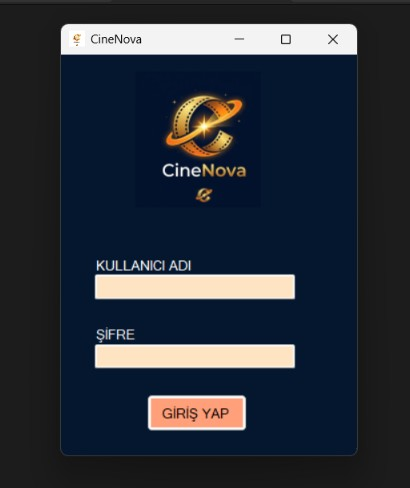
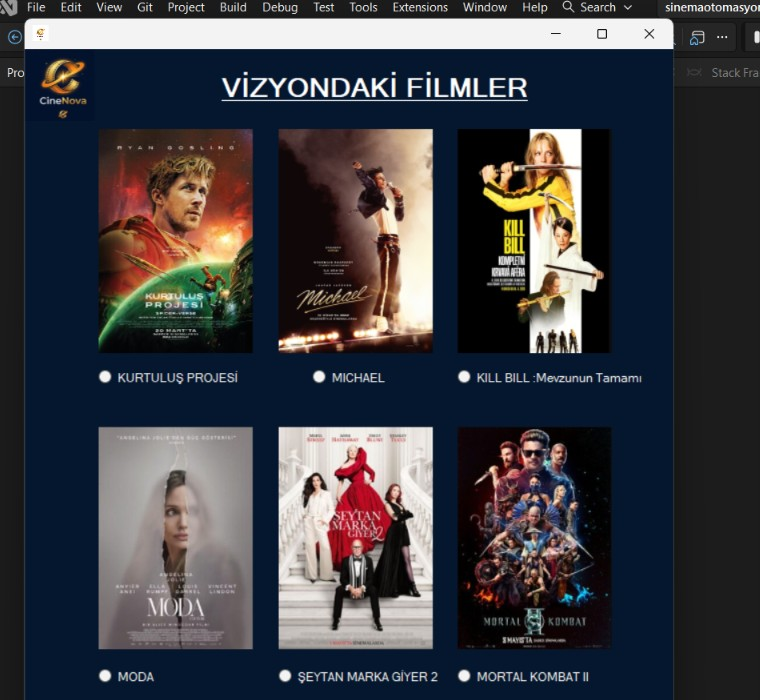
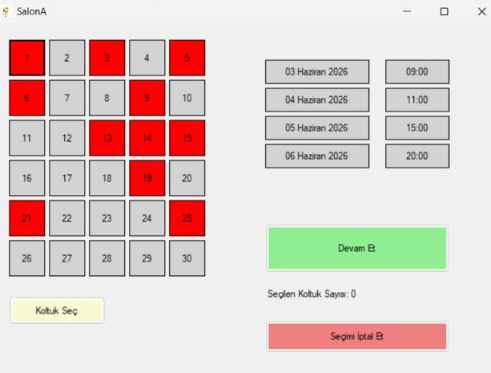
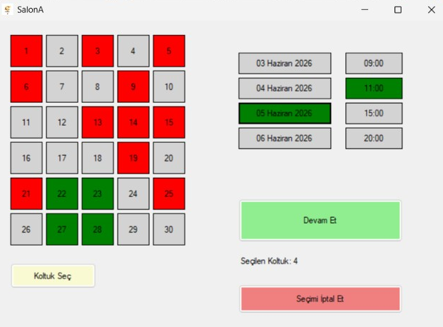
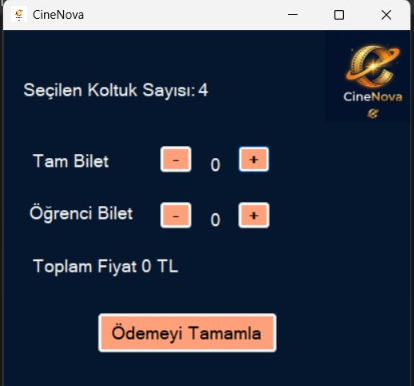
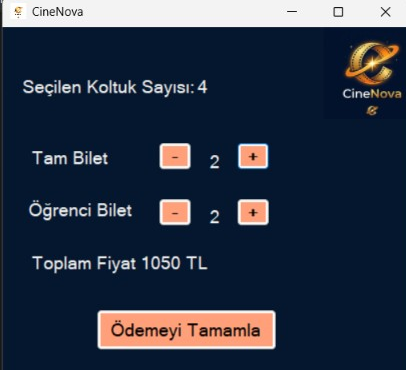

# 🎬 Sinema Bilet Otomasyonu | Cinema Ticket Automation

### 🇹🇷 [Türkçe](#türkçe)    |    🇬🇧 [English](#english)

---

# 🇹🇷 Türkçe

C# kullanılarak geliştirilen, **Windows Forms tabanlı sinema bilet otomasyon sistemi** projesidir.

Bu proje ile film seçimi, salon seçimi, tarih ve seans seçimi, koltuk seçimi, bilet satın alma ve ödeme işlemlerinin bir masaüstü uygulaması içerisinde gerçekleştirilmesi amaçlanmıştır.

## ✨ Özellikler

- 🔐 Kullanıcı girişi
- 🎬 Film seçimi
- 🏛️ Sinema salonu seçimi
- 📅 Tarih ve seans seçimi
- 💺 Koltuk seçimi
- 🪑 Rastgele dolu koltuklar
- 🎟️ Bilet satın alma
- 💳 Ödeme ekranı
- ⚠️ Giriş ve seçim kontrolleri

## 🛠️ Kullanılan Teknolojiler

- **C#**
- **Windows Forms**
- **.NET**
- **Visual Studio**

## 🎬 Çalışma Mantığı

1. Kullanıcı giriş ekranı üzerinden sisteme giriş yapar.
2. Vizyondaki filmler arasından seçim yapılır.
3. Film için ilgili sinema salonu açılır.
4. Tarih ve seans saati seçilir.
5. Boş koltuklar arasından seçim yapılır.
6. Koltuk seçimi onaylanır.
7. Bilet satın alma ekranına geçilir.
8. Ödeme işlemi tamamlanır.

## 📸 Ekran Görüntüleri

### 🔐 Giriş Ekranı



### 🎬 Film Seçim Ekranı



### 💺 Koltuk Seçimi



### ✅ Seçilen Koltuklar



### 🎟️ Bilet Ekranı



### 💳 Ödeme Ekranı



## 🚀 Projeyi Çalıştırma

1. Repository'yi klonlayın:

```bash
git clone https://github.com/elaavc/CinemaAutomation-.git
